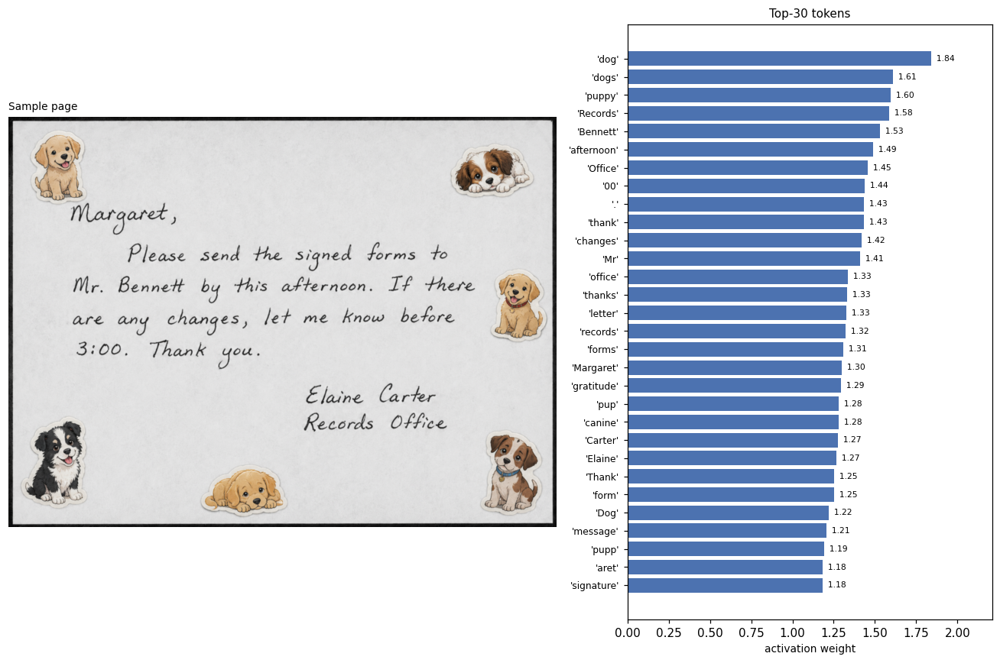
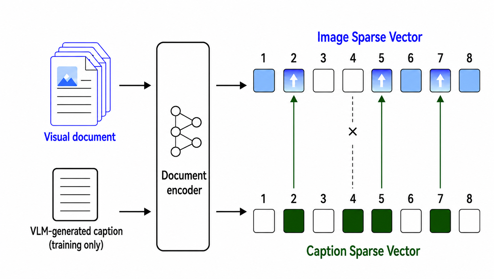

<p align="center">
  
</p>

# V-SPLADE

[](https://arxiv.org/abs/2605.30917)

Official implementation of **V-SPLADE** and **caption-gated token supervision**
— a sparse retriever for visual document retrieval.

V-SPLADE encodes document page images into vocab-dim sparse vectors with a
SPLADE-style sparse head, and encodes queries with an **inference-free
Bag-of-Words / Li-LSR lookup table** (no GPU forward at query time).

## Pretrained weights

Two variants on the HuggingFace Hub:

| Variant | HF Repo | ViDoRe v2 nDCG@5 | Avg FLOPs |
|---|---|---|---|
| **V-SPLADE Quality** | [naver/v-splade-quality](https://huggingface.co/naver/v-splade-quality)   | **0.4990** | 1.51 |
| **V-SPLADE Efficient** | [naver/v-splade-efficient](https://huggingface.co/naver/v-splade-efficient) | 0.4658 | 0.98 |

The inference helper's `--hf_dir` accepts either a HuggingFace Hub repo id
(the export is downloaded automatically) or a local directory.

## Quick start

```bash
git clone https://github.com/<your-org>/V-SPLADE.git
cd V-SPLADE
python -m venv .venv && source .venv/bin/activate
pip install --upgrade pip
pip install torch torchvision torchaudio \
    --index-url https://download.pytorch.org/whl/cu128
grep -v -E '^(torch|flash-attn)==' requirements.txt > requirements_filtered.txt
pip install -r requirements_filtered.txt
pip install flash-attn==2.8.3 --no-build-isolation --no-cache-dir
```

### Single-image inference (minimal example)

The shortest path to seeing V-SPLADE work on your own page image — encode
one image into a sparse vocabulary vector, inspect the top-activated
tokens, and score a text query against it:

```bash
python examples/quickstart.py \
    --hf_dir  <path/to/v-splade-quality> \
    --image   examples/sample_page.png \
    --queries "send signed forms" "records office"
```

Expected output (against the sample page):

```
[2/3] Encoding image: examples/sample_page.png
      sparse vector shape=(50368,)  nnz=552  max=1.836
      Top-10 activated tokens:
          1.836   'dog'
          1.672   'dogs'
          1.586   'puppy'
          1.570   'Records'
          1.523   'Bennett'
          ...
[3/3] Query-image similarity scores
        score=  0.997   query='send signed forms'
          top matches: forms(0.438), send(0.403), signed(0.156)
        score=  0.594   query='records office'
          top matches: office(0.594)
```

The image-side sparse vector activates vocabulary tokens that lexically ground
the page content — both its text and visual elements:



## Method at a glance



V-SPLADE combines a SPLADE-style sparse retriever with a caption-gated
training objective:

1. **Captions** are generated for each page image in the ColPali training set
   using a Qwen3-VL multimodal model (we use the 30B variant; 2B / 4B / 8B /
   235B also work).
2. **Training** minimizes the sum of (i) InfoNCE contrastive loss with
   in-batch and hard negatives, (ii) FLOPS regularization for sparsity,
   and (iii) a **caption-gated token supervision** term.
3. The trained model encodes a document corpus into vocab-dim sparse
   vectors. Queries are encoded with an **inference-free Bag-of-Words**
   encoder.
4. Evaluation is on the **ViDoRe v2** benchmark, reporting nDCG@{5, 10},
   MAP, and Recall@{5, 10, 100}.

## Repository layout

```
.
├── train/                              # Importable model package + training
│   ├── train.py                       # V-SPLADE training entrypoint
│   ├── trainer.py                     # HF Trainer subclass + callbacks
│   ├── dataset.py                     # VisualDataset + collators
│   └── models/                        # Encoder / Pooling / SparseHead /
│                                      # BOWQueryEncoder / Losses / convert
├── scripts/                            # Runnable scripts + shell launchers
│   ├── generate_captions_colpali.py   # Qwen3-VL caption generation
│   ├── encode_sparse_documents.py     # GPU/DDP sparse doc encoder
│   ├── eval_vidore_v2.py              # ViDoRe v2 evaluation
│   ├── convert_modernvbert_backbone.py # upstream ModernVBERT -> V-SPLADE backbone
│   ├── download_data.py
│   ├── generate_captions.sh
│   ├── train.sh
│   ├── encode_documents.sh
│   └── eval_vidore_v2.sh
└── examples/                           # Single-image / single-query demos
    ├── vsplade_inference.py            # Self-contained inference helper
    ├── quickstart.py                   # End-to-end demo (image + queries)
    └── sample_page.png
```

## Requirements

All dependencies are pinned in `requirements.txt`. The roles of each package:

| Package | Version | Role |
|---|---|---|
| `torch` | `2.8.0+cu128` | Training / inference engine. Installed from the official CUDA-12.8 wheel index. |
| `transformers` | `4.57.6` | Backbone loading (`BiModernVBERT`) + `Trainer` / `TrainingArguments` API. |
| `datasets` | `4.5.0` | HuggingFace `load_from_disk` / `Dataset` for the ColPali training set and the ViDoRe v2 corpora. |
| `peft` | `0.17.1` | LoRA adapters on the encoder and the LM-head. |
| `accelerate` | `1.10.1` | Trainer backend for distributed training. |
| `numpy` | `>=1.26,<3.0` | Array ops. |
| `Pillow` | `>=10.0` | PIL image decoding. |
| `flash-attn` | `2.8.3` | Fast attention on H100 / A100. Built against the local CUDA toolchain. |
| `colpali-engine` | latest | `BiModernVBertProcessor` (vision-language pre-processing). |
| `pytrec-eval-terrier` | latest | nDCG / MAP / Recall computation for ViDoRe evaluation. |
| `scipy` | `>=1.11` | CSR sparse matrices written by the encoder. |
| `safetensors` | latest | Checkpoint loading. |
| `vllm` | `0.11.0` | High-throughput inference for Qwen3-VL caption generation. Required only for caption generation. |

## Base models

| Role | HF Repo |
|---|---|
| **V-SPLADE backbone** | [`ModernVBERT/modernvbert`](https://huggingface.co/ModernVBERT/modernvbert) |
| **Caption generation model** | [`Qwen/Qwen3-VL-30B-A3B-Instruct`](https://huggingface.co/Qwen/Qwen3-VL-30B-A3B-Instruct) |

## Data dependencies

| Dataset | HF Repo |
|---|---|
| **ColPali training set** | [`vidore/colpali_train_set`](https://huggingface.co/datasets/vidore/colpali_train_set) |
| **RLHN 680K** | [`rlhn/rlhn-680K`](https://huggingface.co/datasets/rlhn/rlhn-680K) |
| **ViDoRe v2 — ESG reports** | [`vidore/esg_reports_v2`](https://huggingface.co/datasets/vidore/esg_reports_v2) |
| **ViDoRe v2 — Biomedical lectures** | [`vidore/biomedical_lectures_v2`](https://huggingface.co/datasets/vidore/biomedical_lectures_v2) |
| **ViDoRe v2 — Economics reports** | [`vidore/economics_reports_v2`](https://huggingface.co/datasets/vidore/economics_reports_v2) |
| **ViDoRe v2 — ESG reports (human-labeled)** | [`vidore/esg_reports_human_labeled_v2`](https://huggingface.co/datasets/vidore/esg_reports_human_labeled_v2) |

## Training pipeline

### Caption generation

```bash
MODEL_PATH=${MODEL_PATH} \
DATASET_PATH=${DATASET_PATH} \
OUTPUT_DIR=${DATA_ROOT}/captions \
NUM_GPUS=8 BATCH_SIZE=64 \
    bash scripts/generate_captions.sh
```

### Training

`BACKBONE_PATH` defaults to the upstream `ModernVBERT/modernvbert` Hub id and is
downloaded + converted automatically on first run. Set it to a local directory to
use a pre-converted or custom backbone.

```bash
DATASET_PATH=${DATASET_PATH} \
OUTPUT_DIR=${DATA_ROOT}/ckpt/vsplade \
NUM_GPUS=8 BATCH_SIZE=8 NUM_EPOCHS=1 \
LEARNING_RATE=5e-5 CAP_WEIGHT=0.1 REG_WEIGHT_P=0.01 TEMPERATURE=1.0 \
    bash scripts/train.sh
```

Defaults reproduce V-SPLADE *quality*. Key hyperparameters:

- `CAP_WEIGHT` — strength of the caption-gated supervision term.
- `REG_WEIGHT_P` — passage-side FLOPS regularization (sparsity strength).
- `TEMPERATURE` — InfoNCE temperature on (query, passage) dot products.
- `LEARNING_RATE` — AdamW base LR (default `5e-5`).
- `BATCH_SIZE` — per-device batch; effective batch is `NUM_GPUS × BATCH_SIZE`.

## Encoding

```bash
CHECKPOINT=${DATA_ROOT}/ckpt/vsplade \
DATASET_PATH=${VIDORE_V2_PATH}/esg_reports_v2/corpus \
OUTPUT_DIR=${DATA_ROOT}/encoded/esg_reports \
NUM_GPUS=8 BATCH_SIZE=16 MAX_LENGTH=2048 \
    bash scripts/encode_documents.sh
```

> **Note:** image preprocessing on GPU vs. CPU can yield slightly different
> pixel values (resize/normalize kernels differ), which may shift evaluation
> NDCG@5 by roughly ±0.1%.

## Evaluation

```bash
CHECKPOINT=${DATA_ROOT}/ckpt/vsplade \
VIDORE_V2_PATH=${VIDORE_V2_PATH} \
OUTPUT_PATH=${DATA_ROOT}/results/vidore_v2/metrics.json \
NUM_GPUS=8 BATCH_SIZE=16 \
    bash scripts/eval_vidore_v2.sh
```

## License

Apache-2.0 — see [LICENSE](LICENSE).

```
V-SPLADE
Copyright (c) 2026-present NAVER Corp.

Licensed under the Apache License, Version 2.0 (the "License");
you may not use this file except in compliance with the License.
You may obtain a copy of the License at

    http://www.apache.org/licenses/LICENSE-2.0

Unless required by applicable law or agreed to in writing, software
distributed under the License is distributed on an "AS IS" BASIS,
WITHOUT WARRANTIES OR CONDITIONS OF ANY KIND, either express or implied.
See the License for the specific language governing permissions and
limitations under the License.
```

## Citation

```bibtex
@article{cho2026inferencefree,
  title   = {Inference-Free Multimodal Learned Sparse Retrieval for Production-Scale Visual Document Search},
  author  = {Cho, Gyu-Hwung and Lee, Youngjune and Jeong, Kiyoon and Lee, Siyoung and Han, Sanggyu and Dejean, Herv{\'e} and Clinchant, St{\'e}phane and Hwang, Seung-won},
  journal = {arXiv preprint arXiv:2605.30917},
  year    = {2026},
  url     = {https://arxiv.org/abs/2605.30917}
}
```
